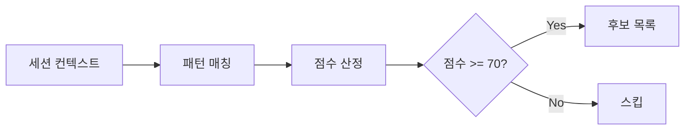

# ax-prompt

프롬프트를 탐지, 정제, 저장하는 명령어입니다.

## 사용법

```
/ax-prompt [command] [options]
```

## 명령어

### detect (기본)

현재 세션에서 재사용 가능한 프롬프트 후보를 탐지합니다.

```
/ax-prompt
/ax-prompt detect
```

**출력**:
```
## 프롬프트 후보 탐지

| # | 소스 | 점수 | 카테고리 (추천) |
|---|------|------|-----------------|
| 1 | 사용자 입력 | 85점 | planning |
| 2 | 작업 결과물 | 72점 | workflow |

선택: 번호 입력 또는 'skip'
```

### save

현재 컨텍스트의 프롬프트를 정제하여 저장합니다.

```
/ax-prompt save
/ax-prompt save --name=my-prompt --category=planning
```

**옵션**:

| 옵션 | 설명 | 기본값 |
|------|------|--------|
| `--name` | 프롬프트 이름 (kebab-case) | 자동 생성 |
| `--category` | 카테고리 | 자동 추천 |
| `--force` | 중복 검사 무시 | false |

### analyze

특정 텍스트의 재사용 가능성을 분석합니다.

```
/ax-prompt analyze "분석할 텍스트..."
/ax-prompt analyze --file=path/to/file.md
```

**출력**:
```
## 프롬프트 분석

**점수**: 85/100

| 항목 | 점수 | 피드백 |
|------|------|--------|
| 반복성 | 20/25 | 유사 패턴 2회 발견 |
| 범용성 | 28/30 | 프로젝트 종속성 낮음 |
| 독립성 | 22/25 | 일부 컨텍스트 의존 |
| 명확성 | 15/20 | 출력 형식 정의 필요 |

**추천 카테고리**: planning
**개선 제안**: 출력 형식 섹션 추가 권장
```

### list

저장된 프롬프트 목록을 조회합니다.

```
/ax-prompt list
/ax-prompt list --category=planning
```

**출력**:
```
## 저장된 프롬프트

### planning (2)
- feature-plan.md - 기능 구현 계획서
- accessibility-plan.md - 접근성 개선 계획서

### quality (1)
- code-review.md - 코드 리뷰 체크리스트

### workflow (1)
- session-wrap-up.md - 세션 정리 템플릿
```

### show

특정 프롬프트의 상세 내용을 표시합니다.

```
/ax-prompt show planning/feature-plan
```

### refine

텍스트를 프롬프트 형식으로 정제합니다 (저장하지 않음).

```
/ax-prompt refine "정제할 텍스트..."
```

**출력**:
```
## 정제 결과

### 추출된 변수
| 변수 | 원본 값 |
|------|---------|
| {{COMPONENT_NAME}} | Button |
| {{FILE_PATH}} | src/button.tsx |

### 정제된 프롬프트
---
name: (미지정)
category: planning
...
---

[정제된 내용]

저장하려면: /ax-prompt save --name=my-prompt
```

## 수행 절차

### 1. 탐지 단계



### 2. 정제 단계

1. 프로젝트 특정 값 식별
2. 플레이스홀더로 변환
3. YAML 프론트매터 생성
4. 섹션 구조화

### 3. 검증 단계

- [ ] 필수 섹션 존재
- [ ] 변수 문서화 완료
- [ ] YAML 유효성
- [ ] 중복 검사

### 4. 저장 단계

1. 파일 생성: `.claude/prompts/{category}/{name}.md`
2. 인덱스 갱신: `.claude/prompts/_registry/prompt-index.json`

## 예시

### 기능 계획서 저장

```
사용자: Button 컴포넌트에 로딩 상태를 추가하는 계획을 세웁니다...
       [상세 계획 내용]

사용자: /ax-prompt save --name=loading-state-plan --category=planning

Claude: ## 저장 완료
        - 경로: .claude/prompts/planning/loading-state-plan.md
        - 변수: {{COMPONENT_NAME}}, {{FEATURE_NAME}}
```

### 세션 종료 시 자동 탐지

```
사용자: /ax-wi wrap-up

Claude: ## 세션 요약
        ...

        ## 프롬프트 후보 발견
        이번 세션에서 재사용 가능한 프롬프트가 감지되었습니다:

        | # | 내용 요약 | 점수 |
        |---|-----------|------|
        | 1 | 접근성 개선 계획 | 88점 |

        저장하시겠습니까? (/ax-prompt save)
```

## 연동 도구

| MCP 도구 | 매핑 명령 |
|----------|-----------|
| `axis.prompt.detect` | `/ax-prompt detect` |
| `axis.prompt.analyze` | `/ax-prompt analyze` |
| `axis.prompt.refine` | `/ax-prompt refine` |
| `axis.prompt.validate` | (내부 사용) |
| `axis.prompt.save` | `/ax-prompt save` |

## 주의사항

- 민감 정보가 포함된 프롬프트는 저장하지 않습니다
- 저장 전 항상 변수화 여부를 확인합니다
- 기존 프롬프트와 80% 이상 유사 시 경고합니다
