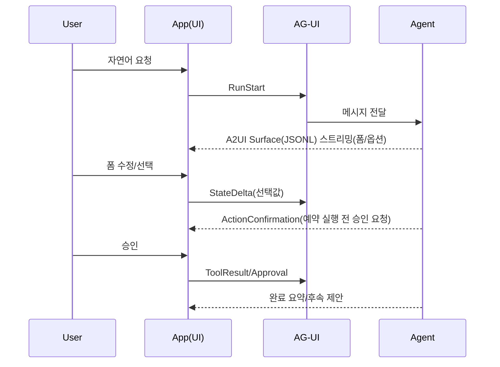

# AXIS 기반 디자인 시스템/UX 프레임워크 적용 기획서 (초안)
> **목적:** 레가시 UI/UX를 “Agentic UI(에이전트 협업 인터페이스)”로 전환하기 위한 **적용 기획(why/what/how)** 문서  
> **범위:** 구현 상세(토큰/컴포넌트 스펙/렌더러 코드/이벤트 스키마)는 별도 기술 문서(설계/개발 명세)로 분리

---

## 0. 문서 정보
- 문서명: AXIS 기반 디자인 시스템/UX 프레임워크 적용 기획서
- 버전: v0.1
- 작성일: 2026-01-14
- 대상: AX BD팀, AX사업개발본부(기획/개발/UX/보안/운영)
- 참고: 이전에 공유된 “AXIS(Agentic eXperience Interface System)” 프레임워크 논의를 기반으로 정리  
  - ※ 참고 PDF 원문은 현재 세션에서 만료되어 직접 인용이 어려워, 대화에서 합의된 프레임 구조를 기획서로 재정리함(원문 인용 필요 시 재업로드 필요)

---

## 1. 결론(요약) — 왜 지금, 무엇을 하자는가
### 1.1 결론
**AX 사업이 ‘AI 기능’에서 ‘에이전트 기반 서비스(업무 수행)’로 이동하면서, UI/UX는 단순 화면이 아니라 ‘통제·신뢰·운영’의 경계면이 되었다.**  
따라서 전사/본부 차원에서 **Agentic UI 표준(AXIS)**을 합의하고, **A2UI(Agent-to-UI) + AG-UI(Agent–User Interaction)**를 활용해 **안전하고 재사용 가능한 경험 자산**을 구축한다.

### 1.2 기대 효과(핵심 4가지)
1) **사업화 가속**: PoC → 상용 전환 리드타임 단축(패턴/컴포넌트/신뢰 규약 재사용)  
2) **리스크 통제**: 승인·중단·복구·감사(로그/근거) UX를 기본값으로 내재화  
3) **고객 신뢰 강화**: 근거/출처/불확실성/책임 경계를 UI에 구조적으로 표현  
4) **플랫폼 확장성**: 웹/모바일/데스크톱에서 일관된 경험(“데이터로 UI 전달 + 네이티브 렌더링” 접근)

---

## 2. 배경 및 문제 정의(As-Is)
### 2.1 레가시 UI/UX의 구조적 한계
레가시 UI는 보통 **정적 정보 구조(메뉴/폼/페이지)**와 **요청-응답** 모델을 전제한다.  
하지만 에이전트 기반 서비스는 다음이 기본이다.
- **장시간 실행**(계획→단계 실행→중간 산출물 스트리밍)
- **상태 동기화**(진행률, 단계/툴 실행, 재시도/취소)
- **사용자 개입**(승인/수정/중단/롤백)
- **신뢰 표현**(근거/출처/불확실성/감사 추적)

결과적으로, 레가시 UI로는 “에이전트가 실제로 일하는 과정”을 안전하고 일관되게 표현하기 어렵다.

### 2.2 표준 부재 시 발생하는 비용
- 프로젝트별 UX가 **제각각** → 고객 경험 불일치, 교육/운영 비용 증가
- 승인/보안/감사 대응이 **사후 땜질** → 사고/컴플라이언스 리스크
- 성공 지표(개입률/실패 복구율/재사용률) 비교 불가 → 개선 루프 부재
- 기술 PoC는 되지만 “상용 운영 가능한 제품 경험”으로 정착 실패

---

## 3. 목표(To-Be) 및 추진 원칙
### 3.1 목표(정량/정성)
- (정량) **AX 과제의 상용 전환 리드타임 20~30% 단축**(MVP 이후 단계 기준)
- (정량) **공통 UX 자산 재사용률 50% 이상**(핵심 패턴/컴포넌트 기준)
- (정성) “에이전트 서비스는 위험하다” 인식을 **통제 가능한 경험**으로 전환
- (정성) 고객이 이해하는 형태로 “무엇을, 왜, 어떻게” 했는지 **설명 가능한 UX** 제공

### 3.2 설계 원칙(요약)
> 구현 수준은 별도 문서로 분리하되, “합의해야 하는 UX 철학”은 본 문서에서 고정한다.

- **Intent-First**: 사용자는 ‘무엇’을 말하고, ‘어떻게’는 에이전트가 수행
- **Progressive Disclosure**: 필요한 순간에 필요한 정보만 단계적으로
- **Human-in-the-Loop**: 고위험/불확실 단계는 사용자 승인·개입이 기본값
- **Transparent Autonomy**: 자동화 수준(자율성)을 UI에 명시
- **Graceful Failure**: 실패 시 복구(재시도/대안/수동 전환) 경로 제공
- **Auditability**: 감사/추적 가능성(누가/언제/무엇을/왜)을 UX 요소로 내재화

---

## 4. 적용 범위(Scope)
### 4.1 적용 대상
- AX 과제 중 **에이전트가 “업무를 수행”**하고, 사용자 승인/상태/진행이 중요한 서비스
  - 예: 보고서 생성/요약, 일정/회의 예약, 티켓 처리, RFP/제안서 지원, 운영 자동화 등

### 4.2 제외(Out of Scope)
- 전사 디자인 시스템 전면 개편(브랜딩 리뉴얼 등) 자체가 목적이 아님
- 모델/에이전트 자체 성능 개선(추론/파인튜닝)은 별도 트랙
- 구현 상세(컴포넌트 스펙/토큰 정의/렌더러 구현/프로토콜 어댑터)는 별도 문서

### 4.3 채널 범위
- 1차: Web(내부/고객 포털)  
- 2차: Mobile(필요 시) / Desktop(콘솔/운영툴) 확장

---

## 5. 핵심 개념: A2UI + AG-UI를 왜 쓰는가(기획 관점)
### 5.1 A2UI(Agent-to-UI): “코드를 보내지 말고, 데이터로 UI를 선언한다”
- LLM/에이전트가 **플랫폼 독립적 UI 정의를 스트리밍(JSONL)**으로 전송
- 클라이언트는 **자체 디자인 시스템(신뢰된 위젯 카탈로그)**으로 렌더링
- 장점: 보안/브랜드 일관성/이식성/점진 렌더링(Perceived performance)

### 5.2 AG-UI(Agent–User Interaction): “실행/상태/툴/승인을 이벤트로 표준화한다”
- 에이전트 실행(run)의 시작/종료, 메시지 스트리밍, 툴 호출, 상태 스냅샷/델타 등을 **이벤트 스트림**으로 표준화
- 장점: 실시간 피드백, 승인 워크플로우, 상태 동기화, 운영/디버깅 가능성 향상

> **요약:** A2UI는 “UI 표현 언어”, AG-UI는 “상호작용/상태의 배선(프로토콜)”로 역할이 분리된다.

---

## 6. Use Case 기반 도입 시나리오(직관화)
> 토론/교육 목적: “레가시 화면”이 아니라 “에이전트 협업 경험”을 무엇으로 구성하는지 공유

### 6.1 Use Case A — 회의 예약(동적 폼 + 승인)
- 사용자: “다음 주 화요일 오후에 A/B/C랑 30분 회의 잡아줘”
- 에이전트: 참석자/시간/회의실/온라인 링크 후보를 조사 → **동적 폼(A2UI)** 제시
- 사용자: 폼에서 선택/수정 → **상태 동기화(AG-UI)**
- 실행 전: **승인(impact=medium)** 후 실제 예약 실행
- 결과: 요약 + 변경사항 + 후속 액션(초대 메일/회의록 템플릿)

### 6.2 Use Case B — 보고서 생성(계획→단계→스트리밍→검토)
- “월간 성과 보고서 만들어줘”
- Plan 제시(목차/데이터 소스/지표) → 사용자 조정
- 단계 실행(수집/정제/분석/시각화/문서화) 진행률 표시
- 결과물은 “요약 + 근거/출처 + 다운로드/공유” 형태로 제공
- 신뢰 낮은 구간은 “검토 요청/추가 데이터 요구”로 전환

### 6.3 Use Case C — 고위험 액션(권한/데이터 변경) 안전장치
- “권한을 전사로 열어줘”, “대량 데이터 수정해줘” 등
- **위험도 평가 → 강제 승인(impact=high/critical) → 롤백/감사 로그**가 UX 레벨에서 기본값

---

## 7. 요구사항(Requirements) — ‘필수 경험’ 중심
### 7.1 기능 요구사항(FR)
1) **에이전트 실행 가시화**
   - run/step, 진행률, 대기/재시도/취소 상태 표시
2) **동적 UI(Surface) 렌더링**
   - 폼/테이블/요약 카드 등 구조화 인터랙션을 대화 맥락에 맞게 제공
3) **승인/개입 메커니즘(통제 UX)**
   - 고위험 액션: 사전 승인, 변경 내역 요약, 되돌리기(가능한 범위)
4) **신뢰/투명성**
   - 출처/근거/불확실성 표시(최소 2단계: 요약/상세)
5) **관찰 가능성(Observability)**
   - 개입률, 취소율, 실패율, 복구율 등 UX 지표 수집(표준 이벤트 기반)

### 7.2 비기능 요구사항(NFR)
- **보안**: “허용된 카탈로그 컴포넌트만 렌더”, 임의 코드 실행 금지(Generative UI 안전장치)
- **권한/감사**: RBAC 기반 설명 레이어/로그 접근, 감사 추적(누가/언제/무엇을)
- **성능**: 스트리밍 기반 점진 렌더링, 초기 인터랙션 지연 최소화
- **접근성**: 색상 의존 최소화, 텍스트/라벨 기반 상태 전달
- **호환성**: 기존 레가시 화면과 공존(점진 전환), 실패 시 fallback 경로
- **변경 관리**: 프로토콜/스펙 업데이트 대응(버전 관리/호환 레이어)

---

## 8. 추진 방식(Approach): “무겁게 프레임워크 만들기”가 아니라 “경험 자산을 제품화”
### 8.1 원칙
- **MVP 우선**: 가장 체감되는 Use Case 1~2개에 적용해 학습/확산
- **표준은 ‘경험의 최소 단위’부터**: 승인/상태/신뢰 표현 같은 공통 핵심을 먼저 고정
- **공존 전략**: 레가시 UI와 Agentic UI를 병행(완전 대체가 목적이 아님)

### 8.2 산출물(Deliverables)
- (기획/가이드) Agentic UX 원칙/패턴 가이드(내부 표준)
- (운영/거버넌스) 고위험 액션 승인 규칙, 신뢰 표시 규칙, 로그/감사 정책(UX 관점)
- (레퍼런스) 대표 Use Case 레퍼런스 화면(디자인 + 동작 정의)
- (기술 준비물) A2UI 카탈로그 정의(최소 컴포넌트 세트), AG-UI 이벤트 매핑(최소 세트)
  - ※ 기술 상세는 설계/개발 문서로 분리

---

## 9. 거버넌스 및 협업 체계(RACI 초안)
### 9.1 역할 정의
- **Product Owner(AX BD/본부)**: 적용 우선순위, KPI, 사업화 기준
- **UX/Design Owner**: 패턴/가이드, 카탈로그 컴포넌트 승인, 접근성 표준
- **Engineering Owner**: 렌더러/프로토콜 어댑터, 레퍼런스 구현, 성능/안정성
- **Security/Compliance**: 승인·로그·권한 정책, 데이터 처리 원칙 검토
- **Operations(SRE/운영)**: 모니터링/알림, 장애 대응/회복 시나리오

### 9.2 의사결정 체계(예시)
- 월 1회: AXIS Steering(본부) — 범위/정책/우선순위
- 격주: Working Group(AX BD+UX+Dev+Sec) — 패턴/표준 검토, 레퍼런스 적용
- 상시: 카탈로그 변경 PR 프로세스(승인자 명확화)

---

## 10. 로드맵(초안) 및 마일스톤
### Phase 0. 합의(2~3주)
- Agentic UX 원칙/범위 합의(본 문서 확정)
- 우선 적용 Use Case 1~2개 선정
- KPI/지표 정의(개입률/전환 리드타임/재사용률 등)

### Phase 1. MVP(6~8주)
- 레퍼런스 UX 흐름(Use Case) 1개 구현
- 최소 카탈로그(10~20 컴포넌트) + 승인/상태/신뢰 표현 규칙 적용
- 운영 지표 수집 시작

### Phase 2. 확산(8~12주)
- Use Case 2~3개로 확대
- 레가시 화면과 공존 전략 고도화(딥링크/전환 지점 설계)
- 보안/감사 UX 표준 강화

### Phase 3. 플랫폼화(상시)
- 카탈로그/패턴 재사용률 기반 제품화
- 조직별 적용 템플릿/가이드 배포
- 스펙 업데이트(A2UI/AG-UI) 대응 프로세스 정착

---

## 11. KPI(성과 지표) 제안
- **Lead Time**: PoC→상용 전환 기간(주 단위) 변화
- **Reuse Ratio**: 공통 패턴/컴포넌트 재사용률
- **Intervention Rate**: 사용자 개입률(승인/수정/중단) — “높을수록 좋은” 구간/“낮을수록 좋은” 구간 구분 필요
- **Recovery Rate**: 실패 후 복구 성공률(재시도/대안 경로)
- **Trust Signals**: 근거/출처 열람률, 피드백(좋음/나쁨), CS 이슈 감소

---

## 12. 리스크 및 대응
1) **스펙 변동(A2UI/AG-UI)**  
   - 대응: 버전 고정 + 호환 레이어 + 분기별 업데이트 검토
2) **보안(Generative UI 오남용/인젝션)**  
   - 대응: 카탈로그 화이트리스트, 고위험 액션 게이팅, 감사 로그
3) **조직 채택 저항(“또 다른 표준?”)**  
   - 대응: MVP로 “시간 절감/품질 상승”을 수치로 증명
4) **레가시 공존 복잡성**  
   - 대응: 전환 지점 정의(어디서 agentic, 어디서 legacy), fallback 규칙 고정

---

## 13. 다음 액션(회의/결정 필요)
- [결정] 적용 우선 Use Case 1~2개 선정(내부/외부 서비스 구분)
- [결정] “고위험 액션” 정의 및 승인 정책 초안 합의
- [결정] KPI 3~5개 확정(측정 방식 포함)
- [착수] 워킹그룹 구성 및 6~8주 MVP 일정 수립

---

## 부록 A. 용어 정리
- **Agentic UI**: 에이전트가 계획/실행하는 과정을 사용자가 이해/통제하도록 돕는 UI/UX
- **A2UI**: 에이전트가 UI를 “선언적 데이터(JSONL)”로 스트리밍하고, 클라이언트가 네이티브 위젯으로 렌더링하는 프로토콜
- **AG-UI**: 에이전트와 UI가 메시지/상태/툴/승인 등을 “이벤트 스트림”으로 주고받는 상호작용 프로토콜
- **Human-in-the-Loop**: 자동화 중에도 사용자 승인/개입을 포함하는 설계 원칙

---

## 부록 B. 참고(공개 자료)
> 아래 링크는 외부 공개 자료로, 내부 표준 논의의 “근거/참조” 용도입니다.

- Google Developers Blog — Introducing A2UI (Dec 15, 2025)  
  https://developers.googleblog.com/introducing-a2ui-an-open-project-for-agent-driven-interfaces/
- A2UI 공식 사이트 / v0.8 Specification (Updated Nov 12, 2025)  
  https://a2ui.org/  
  https://a2ui.org/specification/v0.8-a2ui/
- AG-UI Docs — Events / State( JSON Patch RFC 6902 기반)  
  https://docs.ag-ui.com/concepts/events  
  https://docs.ag-ui.com/concepts/state
- Microsoft Learn — AG-UI Integration / Human-in-the-Loop / State management (Nov 11, 2025)  
  https://learn.microsoft.com/en-us/agent-framework/integrations/ag-ui/  
  https://learn.microsoft.com/en-us/agent-framework/integrations/ag-ui/human-in-the-loop  
  https://learn.microsoft.com/en-us/agent-framework/integrations/ag-ui/state-management
