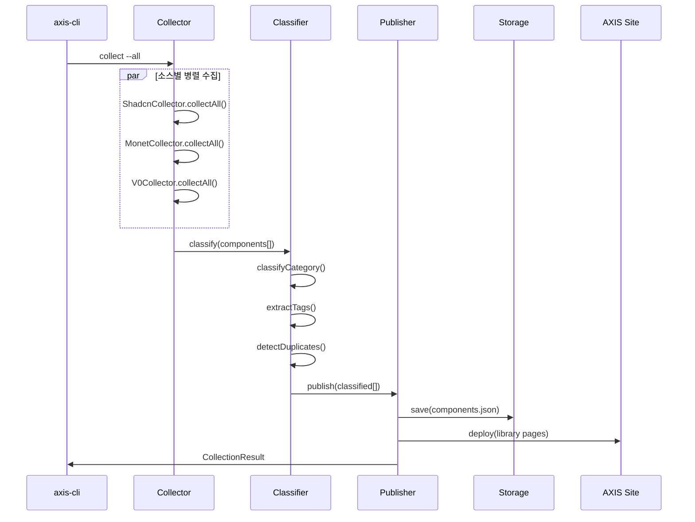
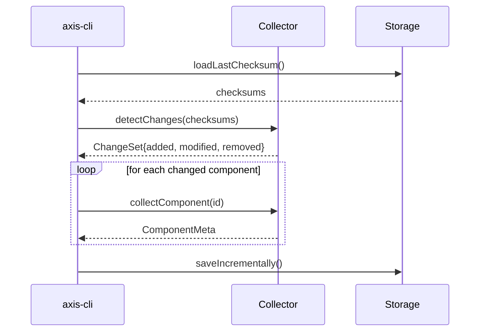

# Library Curator Agent - 설계 명세서

> 디자인 시스템 라이브러리 수집/분류/배치 에이전트

**버전**: 1.0.0-draft
**작성일**: 2026-01-23
**상태**: 설계 중

---

## 1. 개요

### 1.1 목적

Library Curator Agent는 외부 디자인 시스템 소스(shadcn/ui, Monet, V0)에서 컴포넌트를 수집하고, 자동 분류/태깅하여 AXIS Design System 사이트의 라이브러리 페이지에 배치하는 에이전트입니다.

### 1.2 설계 원칙

| 원칙 | 설명 |
|------|------|
| **Source Agnostic** | 다양한 소스에서 통일된 형식으로 수집 |
| **Auto Classification** | 카테고리/태그 자동 분류 |
| **Deduplication** | 중복 컴포넌트 자동 감지 |
| **Incremental Update** | 변경분만 업데이트 |
| **Preview Ready** | 사이트 배치 전 미리보기 제공 |

### 1.3 아키텍처 개요

```
┌─────────────────────────────────────────────────────────────────┐
│                    Library Curator Agent                         │
├─────────────────────────────────────────────────────────────────┤
│                                                                  │
│  ┌────────────────────────────────────────────────────────────┐ │
│  │                     Source Layer                           │ │
│  │  ┌──────────────┐  ┌──────────────┐  ┌──────────────┐     │ │
│  │  │  shadcn/ui   │  │    Monet     │  │      V0      │     │ │
│  │  │  (MCP 서버)   │  │  (API/CLI)   │  │  (GitHub)    │     │ │
│  │  └──────┬───────┘  └──────┬───────┘  └──────┬───────┘     │ │
│  └─────────┼─────────────────┼─────────────────┼─────────────┘ │
│            │                 │                 │                │
│            └─────────────────┼─────────────────┘                │
│                              ▼                                  │
│  ┌────────────────────────────────────────────────────────────┐ │
│  │                   Collector Module                         │ │
│  │  - 소스별 어댑터 (ShadcnCollector, MonetCollector, etc.)   │ │
│  │  - 메타데이터 정규화                                        │ │
│  │  - 원본 코드 수집                                           │ │
│  └───────────────────────────┬────────────────────────────────┘ │
│                              ▼                                  │
│  ┌────────────────────────────────────────────────────────────┐ │
│  │                   Classifier Module                        │ │
│  │  - 카테고리 자동 분류 (UI/Agentic/Layout/Form/...)         │ │
│  │  - 태그 자동 추출                                           │ │
│  │  - 중복 감지 (이름/코드 유사도)                             │ │
│  └───────────────────────────┬────────────────────────────────┘ │
│                              ▼                                  │
│  ┌────────────────────────────────────────────────────────────┐ │
│  │                   Publisher Module                         │ │
│  │  - 라이브러리 JSON 생성                                     │ │
│  │  - 사이트 페이지 데이터 배치                                │ │
│  │  - 변경 이력 관리                                           │ │
│  └───────────────────────────┬────────────────────────────────┘ │
│                              ▼                                  │
│  ┌────────────────────────────────────────────────────────────┐ │
│  │                   Storage Layer                            │ │
│  │  .claude/data/library/                                     │ │
│  │  ├── components.json      # 통합 컴포넌트 DB               │ │
│  │  ├── sources/             # 소스별 원본 캐시               │ │
│  │  └── history/             # 변경 이력                       │ │
│  └────────────────────────────────────────────────────────────┘ │
│                                                                  │
└─────────────────────────────────────────────────────────────────┘
```

---

## 2. 도메인 핵심 질문 (Competency Questions)

### 2.1 수집 관련

```
CQ-01: shadcn/ui에서 사용 가능한 모든 컴포넌트는?
CQ-02: Monet에서 특정 카테고리의 컴포넌트는?
CQ-03: 특정 컴포넌트의 의존성(dependencies)은?
CQ-04: 마지막 수집 이후 변경된 컴포넌트는?
```

### 2.2 분류 관련

```
CQ-05: "Form" 카테고리에 속하는 모든 컴포넌트는?
CQ-06: "agentic" 태그가 붙은 컴포넌트는?
CQ-07: 중복으로 감지된 컴포넌트 쌍은?
CQ-08: 분류되지 않은(uncategorized) 컴포넌트는?
```

### 2.3 배치 관련

```
CQ-09: 현재 라이브러리 페이지에 표시된 컴포넌트 수는?
CQ-10: 최근 7일 내 추가된 컴포넌트는?
CQ-11: 특정 소스에서 가져온 컴포넌트 목록은?
CQ-12: 검색어 "button"에 매칭되는 컴포넌트는?
```

---

## 3. 데이터 모델

### 3.1 ComponentMeta (컴포넌트 메타데이터)

```typescript
interface ComponentMeta {
  // === 식별자 ===
  id: string;                    // 고유 ID (SOURCE-SLUG 형식)
  slug: string;                  // URL 친화적 식별자

  // === 기본 정보 ===
  name: string;                  // 표시 이름
  description: string;           // 설명

  // === 소스 정보 ===
  source: {
    type: SourceType;            // 'shadcn' | 'monet' | 'v0' | 'axis'
    registry: string;            // 레지스트리 이름 (@shadcn, @monet 등)
    url: string;                 // 원본 URL
    version?: string;            // 버전
  };

  // === 분류 ===
  category: ComponentCategory;   // 카테고리
  subcategory?: string;          // 서브카테고리
  tags: string[];                // 태그 목록

  // === 코드 ===
  code: {
    files: CodeFile[];           // 소스 파일 목록
    dependencies: string[];      // 의존성 패키지
    devDependencies: string[];   // 개발 의존성
    registryDeps: string[];      // 레지스트리 내 의존성
  };

  // === 미리보기 ===
  preview?: {
    thumbnail?: string;          // 썸네일 URL
    demoUrl?: string;            // 데모 페이지 URL
    examples?: Example[];        // 사용 예시
  };

  // === 메타 ===
  status: ComponentStatus;       // 'active' | 'deprecated' | 'draft'
  collectedAt: string;           // 수집 일시 (ISO 8601)
  updatedAt: string;             // 업데이트 일시
  checksum: string;              // 코드 체크섬 (변경 감지용)
}

type SourceType = 'shadcn' | 'monet' | 'v0' | 'axis' | 'custom';

type ComponentCategory =
  | 'ui'           // 기본 UI 컴포넌트
  | 'agentic'      // Agentic UI 컴포넌트
  | 'layout'       // 레이아웃 컴포넌트
  | 'form'         // 폼 컴포넌트
  | 'data-display' // 데이터 표시
  | 'feedback'     // 피드백 (알림, 토스트 등)
  | 'navigation'   // 네비게이션
  | 'overlay'      // 오버레이 (모달, 팝오버 등)
  | 'chart'        // 차트/시각화
  | 'utility';     // 유틸리티

type ComponentStatus = 'active' | 'deprecated' | 'draft';

interface CodeFile {
  path: string;                  // 파일 경로
  content: string;               // 파일 내용
  type: 'component' | 'hook' | 'util' | 'style' | 'type';
}

interface Example {
  name: string;                  // 예시 이름
  code: string;                  // 예시 코드
  description?: string;          // 설명
}
```

### 3.2 LibraryIndex (라이브러리 인덱스)

```typescript
interface LibraryIndex {
  version: string;               // 인덱스 버전
  updatedAt: string;             // 마지막 업데이트

  // 통계
  stats: {
    total: number;               // 전체 컴포넌트 수
    bySource: Record<SourceType, number>;
    byCategory: Record<ComponentCategory, number>;
  };

  // 컴포넌트 목록
  components: ComponentMeta[];

  // 카테고리 정의
  categories: CategoryDefinition[];

  // 태그 목록
  tags: TagDefinition[];
}

interface CategoryDefinition {
  id: ComponentCategory;
  name: string;                  // 표시 이름
  description: string;
  icon?: string;                 // 아이콘 이름
  order: number;                 // 정렬 순서
}

interface TagDefinition {
  id: string;
  name: string;
  count: number;                 // 사용 횟수
}
```

### 3.3 CollectionResult (수집 결과)

```typescript
interface CollectionResult {
  source: SourceType;
  timestamp: string;

  // 결과
  success: boolean;
  collected: number;             // 수집된 컴포넌트 수
  updated: number;               // 업데이트된 컴포넌트 수
  failed: number;                // 실패한 컴포넌트 수

  // 상세
  items: CollectionItem[];
  errors: CollectionError[];
}

interface CollectionItem {
  id: string;
  name: string;
  status: 'new' | 'updated' | 'unchanged';
  checksum: string;
}

interface CollectionError {
  id: string;
  error: string;
  recoverable: boolean;
}
```

---

## 4. 모듈 설계

### 4.1 Collector Module

#### 4.1.1 인터페이스

```typescript
interface ICollector {
  readonly sourceType: SourceType;

  // 전체 컴포넌트 목록 조회
  listComponents(): Promise<ComponentListItem[]>;

  // 단일 컴포넌트 상세 수집
  collectComponent(id: string): Promise<ComponentMeta>;

  // 전체 수집 (증분 지원)
  collectAll(options?: CollectOptions): Promise<CollectionResult>;

  // 변경 감지
  detectChanges(lastChecksum: Record<string, string>): Promise<ChangeSet>;
}

interface CollectOptions {
  incremental?: boolean;         // 증분 수집 여부
  filter?: {
    categories?: string[];
    tags?: string[];
  };
}

interface ChangeSet {
  added: string[];               // 새로 추가된 ID
  modified: string[];            // 변경된 ID
  removed: string[];             // 삭제된 ID
}
```

#### 4.1.2 ShadcnCollector

```typescript
class ShadcnCollector implements ICollector {
  readonly sourceType = 'shadcn';

  constructor(private mcpClient: ShadcnMcpClient) {}

  async listComponents(): Promise<ComponentListItem[]> {
    // MCP 서버를 통해 레지스트리 조회
    const registries = await this.mcpClient.getProjectRegistries();
    const items = await this.mcpClient.listItemsInRegistries({
      registries: registries.map(r => r.name)
    });
    return items;
  }

  async collectComponent(id: string): Promise<ComponentMeta> {
    // 상세 정보 조회
    const item = await this.mcpClient.viewItemsInRegistries({
      items: [id]
    });

    // 예제 조회
    const examples = await this.mcpClient.getItemExamples({
      registries: ['@shadcn'],
      query: `${item.name}-demo`
    });

    return this.normalize(item, examples);
  }
}
```

#### 4.1.3 MonetCollector

```typescript
class MonetCollector implements ICollector {
  readonly sourceType = 'monet';

  async listComponents(): Promise<ComponentListItem[]> {
    // axis-cli monet list 활용
    const categories = await this.cli.list();
    const items: ComponentListItem[] = [];

    for (const category of categories) {
      const components = await this.cli.browse(category);
      items.push(...components);
    }

    return items;
  }
}
```

#### 4.1.4 V0Collector

```typescript
class V0Collector implements ICollector {
  readonly sourceType = 'v0';

  async listComponents(): Promise<ComponentListItem[]> {
    // GitHub 저장소에서 동기화된 컴포넌트 조회
    const files = await this.scanV0Directory();
    return files.map(f => this.parseV0Component(f));
  }
}
```

### 4.2 Classifier Module

#### 4.2.1 인터페이스

```typescript
interface IClassifier {
  // 카테고리 분류
  classifyCategory(component: ComponentMeta): ComponentCategory;

  // 태그 추출
  extractTags(component: ComponentMeta): string[];

  // 중복 감지
  detectDuplicates(
    component: ComponentMeta,
    existing: ComponentMeta[]
  ): DuplicateMatch[];
}

interface DuplicateMatch {
  id: string;
  similarity: number;            // 0-1 유사도
  reason: 'name' | 'code' | 'description';
}
```

#### 4.2.2 분류 규칙

```typescript
const CATEGORY_RULES: CategoryRule[] = [
  // Agentic UI
  {
    category: 'agentic',
    patterns: [
      /streaming/i, /agent/i, /approval/i, /step[-_]?indicator/i,
      /tool[-_]?call/i, /run[-_]?container/i, /surface/i
    ],
    keywords: ['agent', 'streaming', 'approval', 'step', 'tool']
  },

  // Form
  {
    category: 'form',
    patterns: [
      /input/i, /select/i, /checkbox/i, /radio/i, /switch/i,
      /form/i, /textarea/i, /slider/i, /date[-_]?picker/i
    ]
  },

  // Layout
  {
    category: 'layout',
    patterns: [
      /container/i, /grid/i, /flex/i, /stack/i, /spacer/i,
      /divider/i, /separator/i, /aspect[-_]?ratio/i
    ]
  },

  // Navigation
  {
    category: 'navigation',
    patterns: [
      /nav/i, /menu/i, /breadcrumb/i, /tabs/i, /pagination/i,
      /sidebar/i, /header/i, /footer/i
    ]
  },

  // Feedback
  {
    category: 'feedback',
    patterns: [
      /toast/i, /alert/i, /notification/i, /progress/i,
      /spinner/i, /skeleton/i, /loading/i
    ]
  },

  // Overlay
  {
    category: 'overlay',
    patterns: [
      /modal/i, /dialog/i, /drawer/i, /popover/i, /tooltip/i,
      /dropdown/i, /sheet/i
    ]
  },

  // Data Display
  {
    category: 'data-display',
    patterns: [
      /table/i, /list/i, /card/i, /avatar/i, /badge/i,
      /tag/i, /timeline/i, /tree/i
    ]
  },

  // Chart
  {
    category: 'chart',
    patterns: [
      /chart/i, /graph/i, /pie/i, /bar/i, /line/i,
      /area/i, /scatter/i, /radar/i
    ]
  },

  // Default: UI
  {
    category: 'ui',
    patterns: [/.*/]  // Fallback
  }
];
```

#### 4.2.3 태그 추출 규칙

```typescript
const TAG_EXTRACTION_RULES = {
  // 코드 기반 태그
  codePatterns: [
    { pattern: /useState|useReducer/, tag: 'stateful' },
    { pattern: /useEffect|useLayoutEffect/, tag: 'side-effects' },
    { pattern: /forwardRef/, tag: 'forwardRef' },
    { pattern: /motion|animate|transition/, tag: 'animated' },
    { pattern: /accessible|aria-/, tag: 'accessible' },
    { pattern: /responsive|breakpoint|media/, tag: 'responsive' },
  ],

  // 의존성 기반 태그
  dependencyTags: {
    'framer-motion': 'animated',
    '@radix-ui': 'radix',
    'react-hook-form': 'form',
    'zod': 'validation',
    'recharts': 'chart',
  }
};
```

### 4.3 Publisher Module

#### 4.3.1 인터페이스

```typescript
interface IPublisher {
  // 라이브러리 인덱스 생성
  generateIndex(components: ComponentMeta[]): LibraryIndex;

  // 사이트 데이터 배치
  publishToSite(index: LibraryIndex): Promise<PublishResult>;

  // 변경 이력 기록
  recordHistory(changeSet: ChangeSet): Promise<void>;
}

interface PublishResult {
  success: boolean;
  publishedAt: string;
  files: string[];               // 생성된 파일 목록
}
```

#### 4.3.2 출력 파일 구조

```
.claude/data/library/
├── components.json              # 전체 컴포넌트 인덱스
├── categories/
│   ├── ui.json                  # 카테고리별 컴포넌트
│   ├── agentic.json
│   ├── form.json
│   └── ...
├── sources/
│   ├── shadcn/                  # 소스별 캐시
│   │   ├── button.json
│   │   └── ...
│   ├── monet/
│   └── v0/
└── history/
    └── 2026-01-23.json          # 일별 변경 이력

apps/web/src/app/library/
├── page.tsx                     # 라이브러리 메인 페이지
├── [category]/
│   └── page.tsx                 # 카테고리별 페이지
└── [category]/[slug]/
    └── page.tsx                 # 컴포넌트 상세 페이지
```

---

## 5. CLI 명령어

### 5.1 수집 명령어

```bash
# 전체 소스에서 수집
axis-cli library collect

# 특정 소스에서만 수집
axis-cli library collect --source shadcn
axis-cli library collect --source monet

# 증분 수집 (변경분만)
axis-cli library collect --incremental

# 드라이런 (실제 저장 없이 미리보기)
axis-cli library collect --dry-run
```

### 5.2 분류 명령어

```bash
# 분류 실행
axis-cli library classify

# 분류되지 않은 컴포넌트 확인
axis-cli library classify --uncategorized

# 중복 감지
axis-cli library classify --detect-duplicates
```

### 5.3 배치 명령어

```bash
# 사이트에 배치
axis-cli library publish

# 미리보기 서버 실행
axis-cli library preview

# 통계 확인
axis-cli library stats
```

### 5.4 검색/조회 명령어

```bash
# 컴포넌트 검색
axis-cli library search "button"

# 카테고리별 목록
axis-cli library list --category agentic

# 태그별 목록
axis-cli library list --tag animated
```

---

## 6. 파이프라인 흐름

### 6.1 전체 수집 파이프라인



### 6.2 증분 업데이트 파이프라인



---

## 7. 사이트 UI 설계

### 7.1 라이브러리 메인 페이지 (/library)

```
┌─────────────────────────────────────────────────────────────────┐
│  Library                                                  🔍    │
├─────────────────────────────────────────────────────────────────┤
│                                                                 │
│  [전체] [UI] [Agentic] [Form] [Layout] [Navigation] [Feedback]  │
│                                                                 │
│  ┌─────────────────┐  ┌─────────────────┐  ┌─────────────────┐ │
│  │    📦 Button    │  │    📦 Card      │  │    📦 Input     │ │
│  │    shadcn/ui    │  │    shadcn/ui    │  │    shadcn/ui    │ │
│  │    #ui #form    │  │    #ui #layout  │  │    #form        │ │
│  └─────────────────┘  └─────────────────┘  └─────────────────┘ │
│                                                                 │
│  ┌─────────────────┐  ┌─────────────────┐  ┌─────────────────┐ │
│  │  🤖 Streaming   │  │  🤖 Approval    │  │  🤖 StepIndicator│ │
│  │     Text        │  │    Dialog       │  │                 │ │
│  │    AXIS         │  │    AXIS         │  │    AXIS         │ │
│  │  #agentic       │  │  #agentic #form │  │  #agentic       │ │
│  └─────────────────┘  └─────────────────┘  └─────────────────┘ │
│                                                                 │
│  ───────────────────────────────────────────────────────────── │
│  📊 통계: 총 45개 | shadcn: 20 | AXIS: 15 | Monet: 10          │
│  🕐 마지막 업데이트: 2026-01-23 14:30                          │
└─────────────────────────────────────────────────────────────────┘
```

### 7.2 컴포넌트 상세 페이지 (/library/[category]/[slug])

```
┌─────────────────────────────────────────────────────────────────┐
│  ← Library / Agentic                                            │
├─────────────────────────────────────────────────────────────────┤
│                                                                 │
│  🤖 Streaming Text                                              │
│  ─────────────────                                              │
│  에이전트 응답을 실시간으로 스트리밍하여 표시하는 컴포넌트      │
│                                                                 │
│  [미리보기]  [코드]  [예제]  [의존성]                            │
│                                                                 │
│  ┌─────────────────────────────────────────────────────────────┐│
│  │                                                             ││
│  │     Hello, I am streaming this text character by char...   ││
│  │     █                                                       ││
│  │                                                             ││
│  └─────────────────────────────────────────────────────────────┘│
│                                                                 │
│  📦 설치                                                        │
│  ┌─────────────────────────────────────────────────────────────┐│
│  │ npx shadcn@latest add https://axis-ds.pages.dev/r/streaming ││
│  └─────────────────────────────────────────────────────────────┘│
│                                                                 │
│  📋 메타데이터                                                  │
│  ├─ 소스: AXIS Design System                                   │
│  ├─ 카테고리: Agentic                                          │
│  ├─ 태그: #agentic #streaming #text                            │
│  └─ 업데이트: 2026-01-23                                       │
│                                                                 │
└─────────────────────────────────────────────────────────────────┘
```

---

## 8. 구현 계획

### 8.1 Phase 1: 기반 구축 (Day 1-2)

| 작업 | 산출물 |
|------|--------|
| Collector 인터페이스 정의 | `ICollector` 타입 |
| ComponentMeta 스키마 정의 | TypeScript 타입 |
| ShadcnCollector 구현 | MCP 연동 수집기 |
| 저장소 구조 생성 | `.claude/data/library/` |

### 8.2 Phase 2: 수집/분류 (Day 3)

| 작업 | 산출물 |
|------|--------|
| MonetCollector 구현 | CLI 연동 수집기 |
| V0Collector 구현 | GitHub 연동 수집기 |
| Classifier 구현 | 자동 분류기 |
| 중복 감지 로직 | 유사도 검사 |

### 8.3 Phase 3: 배치/UI (Day 4)

| 작업 | 산출물 |
|------|--------|
| Publisher 구현 | 사이트 배치 모듈 |
| Library 페이지 UI | `/library` 페이지 |
| 컴포넌트 상세 UI | `/library/[slug]` 페이지 |
| 검색/필터 기능 | 클라이언트 검색 |

### 8.4 Phase 4: CLI/정리 (Day 5)

| 작업 | 산출물 |
|------|--------|
| CLI 명령어 구현 | `axis-cli library` |
| E2E 테스트 | 파이프라인 테스트 |
| 문서화 | 사용 가이드 |
| 릴리스 | v0.7.0 |

---

## 9. 참고 문헌

- [shadcn/ui Registry](https://ui.shadcn.com/docs/registry)
- [shadcn/ui MCP Server](https://ui.shadcn.com/docs/registry/mcp)
- [Monet Design](https://monet.design)
- [V0 by Vercel](https://v0.dev)

---

## 부록 A: 기존 AXIS 컴포넌트 목록

현재 `apps/web/src/app/` 아래 구현된 컴포넌트:

### UI 컴포넌트 (`/components`)

| 컴포넌트 | 경로 | 상태 |
|---------|------|------|
| Button | `/components/button` | ✅ |
| Card | `/components/card` | ✅ |
| Input | `/components/input` | ✅ |
| Badge | `/components/badge` | ✅ |
| Dialog | `/components/dialog` | ✅ |
| Select | `/components/select` | ✅ |
| Label | `/components/label` | ✅ |
| Tabs | `/components/tabs` | ✅ |
| Separator | `/components/separator` | ✅ |
| Toast | `/components/toast` | ✅ |

### Agentic 컴포넌트 (`/agentic`)

| 컴포넌트 | 경로 | 상태 |
|---------|------|------|
| StreamingText | `/agentic/streaming-text` | ✅ |
| ApprovalDialog | `/agentic/approval-dialog` | ✅ |
| StepIndicator | `/agentic/step-indicator` | ✅ |
| ToolCallCard | `/agentic/tool-call-card` | ✅ |
| ActivityPreviewCard | `/agentic/activity-preview-card` | ✅ |
| CollectorHealthBar | `/agentic/collector-health-bar` | ✅ |
| SurfaceRenderer | `/agentic/surface-renderer` | ✅ |
| SeminarChatPanel | `/agentic/seminar-chat-panel` | ✅ |
| FileUploadZone | `/agentic/file-upload-zone` | ✅ |
| AgentRunContainer | `/agentic/agent-run-container` | ✅ |

---

## 부록 B: 버전 히스토리

| 버전 | 날짜 | 변경 내용 |
|------|------|----------|
| 1.0.0-draft | 2026-01-23 | 초기 설계 문서 작성 |
